# custom-named-functions

Collection of custom functions (GAS - Google Apps Script) and named functions (formulae) for Google Sheets.

You can take a look at the spreadsheet with implementations and usage examples here: https://docs.google.com/spreadsheets/d/1FCbEupZSEwHm4QTMY0hdTJPSwNKSrv9AU1TRg6mlGKo/edit?usp=sharing

<br>

# sections
 - [custom functions](#custom-functions)
    - [pythonSlice.gs](#pythonslicegs)
        - [PYTHON_SLICE](#-python_slice)
        - [SLICE](#slice)
 - [named functions](#named-functions)
    - [GET_SHEET_DATA](#get_sheet_data)
    - [REPLACE_COLS](#replace_cols)
    - [SKIP_ROWS](#skip_rows)
    - [QUERY_BY_HEADERS](#query_by_headers)
    - [QUERY_BY_HEADERS2](#query_by_headers2)
    - [DROP](#drop)
    - [TAKE](#take)
    - [TEXTSPLIT](#textsplit)
    - [GET_DATA_RANGE](#get_data_range)
    - [INDIRECT_ADDRESS](#indirect_address)
    - [STARTS_WITH](#starts_with)
    - [ENDS_WITH](#ends_with)
    - [TEXT_CONTAINS](#text_contains)
    - [TEXT_REVERSE](#text_reverse)
    - [REVERSE_RANGE](#reverse_range)
    - [MAP_RANGE](#map_range)
    - [TRIMRANGE](#trimrange)

<br>

## **custom functions**
You can find them in the [GAS folder](GAS).

### [pythonSlice.gs](GAS/pythonSlice.gs)

<br>

#### • **PYTHON_SLICE**
(array, sliceStr)

Replicates Python slicing syntax in Google Sheets.
Works with 1D and 2D arrays (ranges)

Usage:<br>
>  1D: <code>=PYTHON_SLICE(A1:A10, "1:5")</code><br>
>  2D rows: <code>=PYTHON_SLICE(A1:C10, "1:5")</code><br>
>  2D rows & cols: <code>=PYTHON_SLICE(A1:C10, "1:5,0:2")</code><br>
>step: <code>=PYTHON_SLICE(A1:C10, "1:5:2,0:2:2")</code><br>

```
@param {Array} array - The array or range to slice
@param {string} sliceStr - Python-style slice string with optional row,col format

@return {Array} The sliced array
```

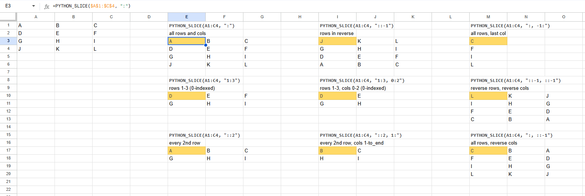

<br>

#### • **SLICE**
(array, sliceStr)

Shorthand function for common slicing operations
<br>
Returns single value if result has 1 element, array otherwise

<br>

## **named functions**

#### • **GET_SHEET_DATA**
(sheet_name, headers)

<details><summary>code</summary>

```
=LAMBDA(sheet_name, headers,
LET(
  sheet_ref, "'" & sheet_name & "'!", 
  first_col, INDIRECT(sheet_ref & "A:A"), 
  first_row, INDIRECT(sheet_ref & "A1:1"), 
  num_rows, MAX(ARRAYFORMULA(ROW(first_col)*(first_col<>""))), 
  num_cols, MAX(ARRAYFORMULA(COLUMN(first_row)*(first_row<>""))), 
  data, INDIRECT(sheet_ref & "A1:" & ADDRESS(num_rows,num_cols,4)), 
  IF(
    OR(headers=1,ISBLANK(headers)),
    data, 
    IF(
      headers=0, 
      CHOOSEROWS(data,SEQUENCE(num_rows-1,1,2)), 
      IF(headers=-1, CHOOSEROWS(data,1), NA())
    )
  )
)
)(sheet_name, headers)
```
</details><br>

Returns data from the specified 'sheet_name'. 

Output is a rectangular range extending from A1 of 'sheet_name' to the LAST non empty cell of the FIRST row and the LAST non empty cell of the FIRST column of the specified sheet.

The 'headers' parameter defines if/how to include headers.

<code>**sheet_name**</code> The name of the sheet from which data will be extracted.<br>
<code>**headers**</code> An indicator of whether to include headers. 1 (default if not specified) will include headers. 0 will exclude headers. -1 will extract headers only.

Example: <code>=GET_SHEET_DATA("Sheet 1", 0)</code>

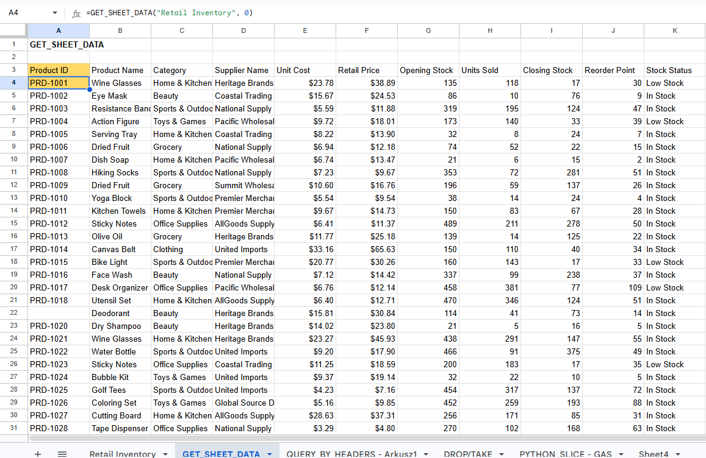

<br>

#### • **QUERY_BY_HEADERS**
(data, query_text)

<details><summary>code</summary>

```
=LAMBDA(data, query_text,
QUERY({data}, LAMBDA(text, columns,
  REDUCE(text, FILTER(columns, NOT(ISBLANK(columns))), LAMBDA(res, col,
    REGEXREPLACE(res, "`" & col & "`", "Col" & MATCH(col, columns, 0))))
  )(query_text, ARRAY_CONSTRAIN(data, 1, COLUMNS(data))),
1)
)(data, query_text)
```
</details><br>

Sourced from here: https://webapps.stackexchange.com/a/167714
Thanks @carecki

Queries the provided data using Google Query language. First row must contain headers, which then are used in the query statement.

<code>**data**</code> data range with headers in the first row<br>
<code>**query_text**</code> query in the Google Query Language syntax where you can use header text wrapped in backticks to reference the columns

Example: <code>=QUERY_BY_HEADERS(A:F, "select \`name\`, \`age\`")</code>

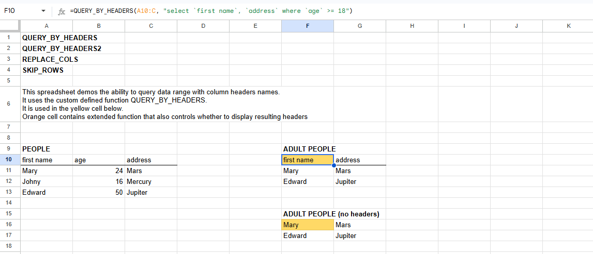

<br>

#### • **REPLACE_COLS**
(text, columns)

<details><summary>code</summary>

```
=LAMBDA(text, columns,
REDUCE(text, FILTER(columns, NOT(ISBLANK(columns))), LAMBDA(res, col, REGEXREPLACE(res, "`" & col & "`", "Col" & MATCH(col, columns, 0))))
)(text, columns)
```
</details><br>

#### • **SKIP_ROWS**
(data, rows_to_skip)

<details><summary>code</summary>

```
=LAMBDA(data, rows_to_skip,
FILTER(data, MAKEARRAY(ROWS(data), 1, LAMBDA(ri, ci, ri > rows_to_skip)))
)(data, rows_to_skip)
```
</details><br>

#### • **QUERY_BY_HEADERS2**
(data, query_text, show_headers)

<details><summary>code</summary>

```
=LAMBDA(data, query_text, show_headers,
LAMBDA(result, IF(show_headers, result, SKIP_ROWS(result, 1)))
(QUERY({data}, REPLACE_COLS(query_text, ARRAY_CONSTRAIN(data, 1, COLUMNS(data))), 1))
)(data, query_text, show_headers)
```
</details><br>

Same as QUERY_BY_HEADERS, with an additional param:<br>
<code>**show_headers**</code> if FALSE the header will not be shown

Example: <code>=QUERY_BY_HEADERS2(A:F, "select \`name\`, \`age\`", FALSE)</code>

<br>

#### • **DROP**
([drop_rows], [drop_cols])

<details><summary>code</summary>

```
=LAMBDA(range, drop_rows, drop_cols,
LET(
  src_rows, ROWS(range),
  src_cols, COLUMNS(range),
  start_row, IF(drop_rows > 0, drop_rows + 1, 1),
  end_row, IF(drop_rows > 0, src_rows, src_rows + drop_rows),
  start_col, IF(drop_cols > 0, drop_cols + 1, 1),
  end_col, IF(drop_cols > 0, src_cols, src_cols + drop_cols),
  rcind, {start_row, end_row; start_col, end_col},
  dst_rows, end_row-start_row + 1,
  dst_cols, end_col-start_col + 1,
  result, MAKEARRAY(dst_rows, dst_cols, 
    LAMBDA(r, c, INDEX(range, r + start_row - 1, c + start_col - 1))
  ),
  result
)
)(range, drop_rows, drop_cols)
```
</details><br>

Drops the specified number of rows/columns.
Supports negative indexing (i.e. from end of range).

<code>**range**</code> the array on which operate<br>
<code>**drop_rows**</code> (optional) num rows to drop (supports negative indexing)<br>
<code>**drop_cols**</code> (optional) num columns to drop (supports negative indexing)<br>

Example: <code>=DROP(A1:C5, 1, -1)</code>

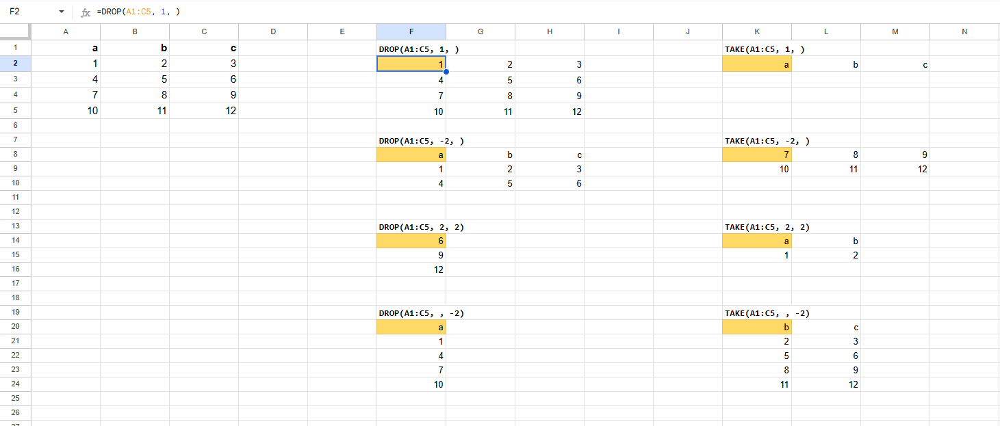

<br>

#### • **TAKE**
([take_rows], [take_cols])

<details><summary>code</summary>

```
=LAMBDA(range, take_rows, take_cols,
LET(
  src_rows, ROWS(range),
  src_cols, COLUMNS(range),
  start_row, IF(take_rows < 0, src_rows + take_rows + 1, 1),
  end_row, IF(take_rows <= 0, src_rows, take_rows),
  start_col, IF(take_cols < 0, src_cols + take_cols + 1, 1),
  end_col, IF(take_cols <= 0, src_cols, take_cols),
  rcind, {start_row, end_row; start_col, end_col},
  dst_rows, end_row - start_row + 1,
  dst_cols, end_col - start_col + 1,
  result, MAKEARRAY(dst_rows, dst_cols, 
    LAMBDA(r, c, INDEX(range, r + start_row - 1, c + start_col - 1))
  ),
  result
)
)(range, take_rows, take_cols)
```
</details><br>

Takes the specified number of rows/columns (discards the rest).
Supports negative indexing (i.e. from end of range).

<code>**range**</code> the array on which operate<br>
<code>**take_rows**</code> (optional) num rows to take (supports negative indexing)<br>
<code>**take_cols**</code> (optional) num columns to take (supports negative indexing)<br>

Example: <code>=TAKE(A1:C5, 1, -2)</code>

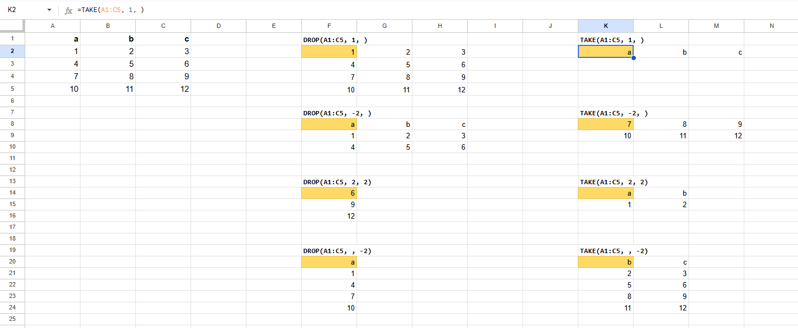

<br>

#### • **TEXTSPLIT**
(text, [col_delimiter], [row_delimiter], [ignore_empty], [pad_with])

<details><summary>code</summary>

```
=LAMBDA(text, col_delimiter, row_delimiter, ignore_empty, pad_with,
LET(
  colDelim, col_delimiter,
  rowDelim, row_delimiter,
  ignoreEmpty, IF(ISBLANK(ignore_empty), FALSE, ignore_empty),
  padValue, IF(ISBLANK(pad_with), "", pad_with),
  
  rawRowSplit, IF(
    ISBLANK(rowDelim), {text}, IF(
      rowDelim = "", ARRAYFORMULA(MID(text, SEQUENCE(1, LEN(text)), 1)),
      SPLIT(text, rowDelim, FALSE, ignoreEmpty)
    )
  ),
 
  rowSplit, TRANSPOSE(rawRowSplit),
      
  splitted, IF(
    ISBLANK(colDelim), rowSplit, IF(
      colDelim = "", BYROW(rowSplit, LAMBDA(rowText, ARRAYFORMULA(MID(rowText, SEQUENCE(1,LEN(rowText)), 1)))),
      ARRAYFORMULA(IF(rowSplit = "", "", SPLIT(rowSplit, colDelim, FALSE, ignoreEmpty)))
    )
  ),
  padded, MAKEARRAY(ROWS(splitted), COLUMNS(splitted),
    LAMBDA(r, c, IF(INDEX(splitted, r, c) = "", padValue, INDEX(splitted, r, c)))
  ),
  IF(text="", "", padded)
)
)(text, col_delimiter, row_delimiter, ignore_empty, pad_with)
```
</details><br>

Splits text at specified delimiters. Supports both row and column delimiters.

<code>**text**</code> the text on which operate<br>
<code>**col_delimiter**</code> (optional) columns will be split at this delimiter. Use "" to split into individual chars<br>
<code>**row_delimiter**</code> (optional) rows will be split at this delimiter. Use "" to split into individual chars<br>
<code>**ignore_empty**</code> (optional) specify TRUE to ignore consecutive delimiters. Defaults to FALSE, which creates an empty cell<br>
<code>**pad_with**</code> (optional) the value with which to pad the result (and empty cells). The default is ""

Example: <code>=TEXTSPLIT(A1, ",", ";", TRUE, "---")</code>

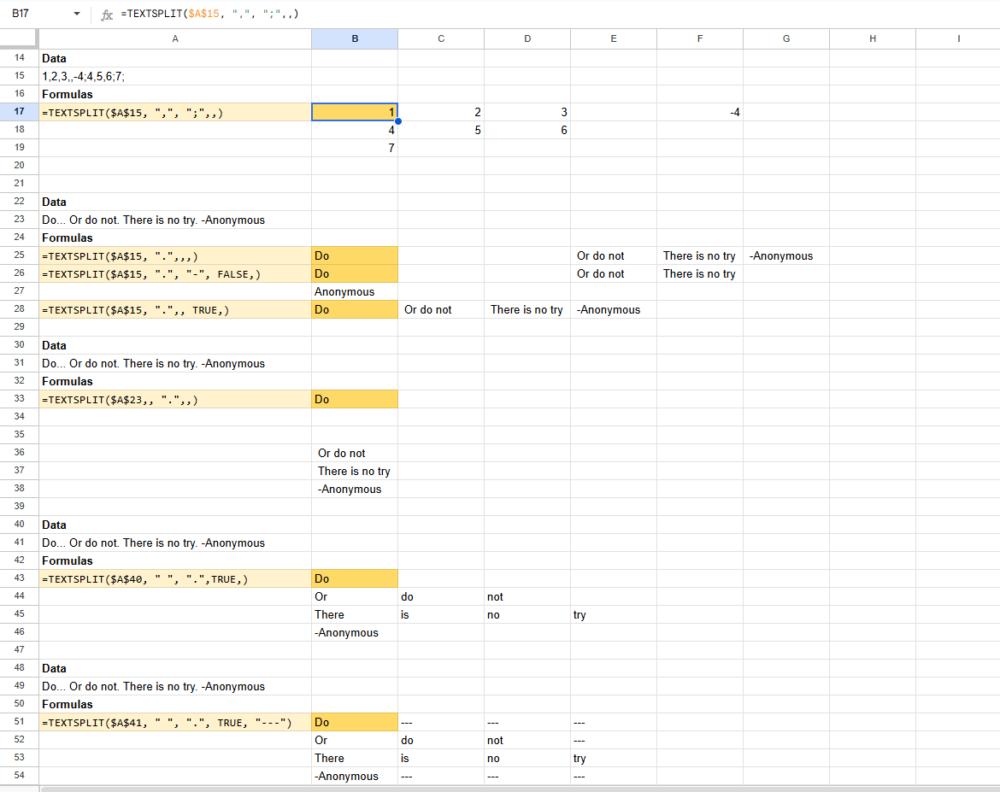

<br>

#### • **GET_DATA_RANGE**
(sheet_name, row_or_ref, col_or_ref, headers, max_rows, max_cols)

<details><summary>code</summary>

```
=LAMBDA(sheet_name, row_or_ref, col_or_ref, headers, max_rows, max_cols,
LET(
  sheet_ref, "'" & sheet_name & "'!",
  first_row_index, IF(ISREF(row_or_ref), ROW(row_or_ref), row_or_ref),
  first_col_index, IF(ISREF(col_or_ref), COLUMN(col_or_ref), col_or_ref),
  first_cell_address, ADDRESS(first_row_index, first_col_index),
  max_row_index, IF(max_rows, first_row_index + max_rows - 1, first_row_index),
  max_col_index, IF(max_cols, first_col_index + max_cols - 1, first_col_index),
  first_cell_col, REGEXEXTRACT(first_cell_address, "[A-Za-z]+"),
  first_row_address, sheet_ref & first_cell_address & ":" & IF(ISBLANK(max_cols), first_row_index, ADDRESS(first_row_index, max_col_index)),
  first_row, INDIRECT(first_row_address), 
  first_col_address, sheet_ref & first_cell_address & ":" & IF(ISBLANK(max_rows), first_cell_col, first_cell_col & max_row_index),
  first_col, INDIRECT(first_col_address), 
  num_rows, MAX(ARRAYFORMULA(ROW(first_col)*(first_col<>""))), 
  num_cols, MAX(ARRAYFORMULA(COLUMN(first_row)*(first_row<>""))), 
  data_address, sheet_ref & first_cell_address & ":" & ADDRESS(num_rows,num_cols,4),
  data, INDIRECT(data_address), 
  result, IF(
    OR(headers=1,ISBLANK(headers)),
    data, 
    IF(
      headers=0, 
      CHOOSEROWS(data,SEQUENCE(num_rows-1,1,2)), 
      IF(headers=-1, CHOOSEROWS(data,1), NA())
    )
  ),
  addrs, {first_cell_address, first_row_address, first_col_address, data_address},
  result
)
)(sheet_name, row_or_ref, col_or_ref, headers, max_rows, max_cols)
```
</details><br>

More powerful version of GET_SHEET_DATA. 

Returns data from the specified coords in 'sheet_name'. 

Output is a rectangular range extending from the cell identified by 'row_or_ref' and 'col_or_ref' of 'sheet_name' to the LAST non empty cell of the identified row and the LAST non empty cell of the identified column of the specified sheet.

The 'headers' parameter defines if/how to include headers.
'max_rows' and 'max_cols' limit the output size.

<code>**sheet_name**</code> The name of the sheet from which data will be extracted.<br>
<code>**row_or_ref**</code> (otional) row index or cell ref<br>
<code>**col_or_ref**</code> (otional) column index or cell ref<br>
<code>**headers**</code> An indicator of whether to include headers. 1 (default if not specified) will include headers. 0 will exclude headers. -1 will extract headers only.<br>

Example: <code>=GET_DATA_RANGE("Retail Inventory", 1, 1, 0, 10,)</code>

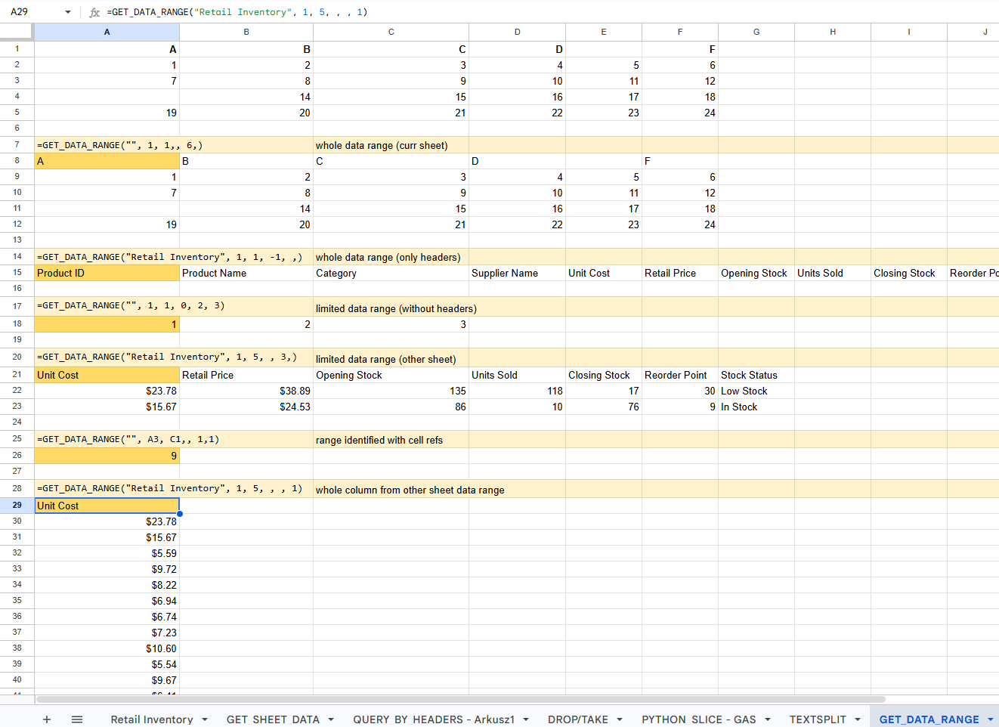

<br>

#### • **INDIRECT_ADDRESS**
(row_or_ref, col_or_ref, [sheet_name])

<details><summary>code</summary>

```
=LAMBDA(row_or_ref, col_or_ref, sheet_name,
LET(
  sheet_ref, "'" & sheet_name & "'!",
  first_row_index, IF(ISREF(row_or_ref), ROW(row_or_ref), row_or_ref),
  first_col_index, IF(ISREF(col_or_ref), COLUMN(col_or_ref), col_or_ref),
  first_cell_col, REGEXEXTRACT(ADDRESS(1, first_col_index), "[A-Za-z]+"),
  whole_row_address, sheet_ref & first_row_index & ":" & first_row_index,
  whole_col_address, sheet_ref & first_cell_col & ":" & first_cell_col,
  data_address, IFS(
    ISBLANK(row_or_ref), whole_col_address,
    ISBLANK(col_or_ref), whole_row_address,
    TRUE, sheet_ref & ADDRESS(first_row_index, first_col_index)
  ),
  data, INDIRECT(data_address),
  data
)
)(row_or_ref, col_or_ref, sheet_name)
```
</details><br>

Returns the cell identified by 'row_or_ref' and 'col_or_ref' in 'sheet_name'.

If 'row_or_ref' or 'col_or_ref' are not specified, the whole row or column (respectively) will be returned.

<code>**row_or_ref**</code> (otional) row index or cell ref<br>
<code>**col_or_ref**</code> (otional) column index or cell ref<br>
<code>**sheet_name**</code> The name of the sheet from which data will be extracted (defaults to current one)<br>

Example: <code>=INDIRECT_ADDRESS(10, , "Retail Inventory")</code>

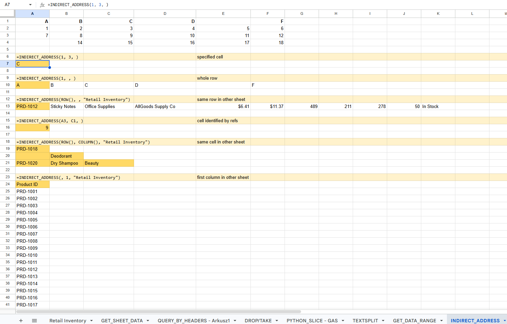

<br>

#### • **STARTS_WITH**
(text, search_for, [ignore_case])

<details><summary>code</summary>

```
=LAMBDA(text, search_for, ignore_case,
LET(
  _ignore_case, IF(ISBLANK(ignore_case), TRUE, ignore_case),
  _text, IF(_ignore_case, LOWER(text), text),
  _search_for, IF(_ignore_case, LOWER(search_for), search_for),
  _search_for_length, LEN(_search_for),
  result, EXACT(LEFT(_text, _search_for_length), _search_for),
  result
)
)(text, search_for, ignore_case)
```
</details><br>

Check wether 'text' starts with  'search_for'. 

If 'ignore_case' is set to FALSE the comparison will be case-sensitive (defaults to TRUE).


<code>**text**</code> Text to be searched<br>
<code>**search_for**</code> Text to be searched for<br>
<code>**ignore_case**</code> (optional) If set to FALSE the comparison will be case-sensitive (defaults to TRUE)<br>

Example: <code>=STARTS_WITH("dRaGOn", "DRAG")</code>

<br>

#### • **ENDS_WITH**
(text, search_for, [ignore_case])

<details><summary>code</summary>

```
=LAMBDA(text, search_for, ignore_case,
LET(
  _ignore_case, IF(ISBLANK(ignore_case), TRUE, ignore_case),
  _text, IF(_ignore_case, LOWER(text), text),
  _search_for, IF(_ignore_case, LOWER(search_for), search_for),
  _search_for_length, LEN(_search_for),
  result, EXACT(RIGHT(_text, _search_for_length), _search_for),
  result
)
)(text, search_for, ignore_case)
```
</details><br>

Check wether 'text' ends with  'search_for'. 

If 'ignore_case' is set to FALSE the comparison will be case-sensitive (defaults to TRUE).


<code>**text**</code> Text to be searched<br>
<code>**search_for**</code> Text to be searched for<br>
<code>**ignore_case**</code> (optional) If set to FALSE the comparison will be case-sensitive (defaults to TRUE)<br>

Example: <code>=ENDS_WITH("dRaGOn", "ON")</code>

<br>

#### • **TEXT_CONTAINS**
(text, search_for, [ignore_case])

<details><summary>code</summary>

```
=LAMBDA(text, search_for, ignore_case,
LET(
  _ignore_case, IF(ISBLANK(ignore_case), TRUE, ignore_case),
  _text, IF(_ignore_case, LOWER(text), text),
  _search_for, IF(_ignore_case, LOWER(search_for), search_for),
  _search_for_length, LEN(_search_for),
  result, IF(_search_for = "", 0, FIND(_search_for, _text)),
  IFERROR(result >= 0, FALSE)
)
)(text, search_for, ignore_case)
```
</details><br>

Check wether 'text' contains  'search_for'. 

If 'ignore_case' is set to FALSE the comparison will be case-sensitive (defaults to TRUE).


<code>**text**</code> Text to be searched<br>
<code>**search_for**</code> Text to be searched for<br>
<code>**ignore_case**</code> (optional) If set to FALSE the comparison will be case-sensitive (defaults to TRUE)<br>

Example: <code>=TEXT_CONTAINS("dRaGOn", "RAG")</code>

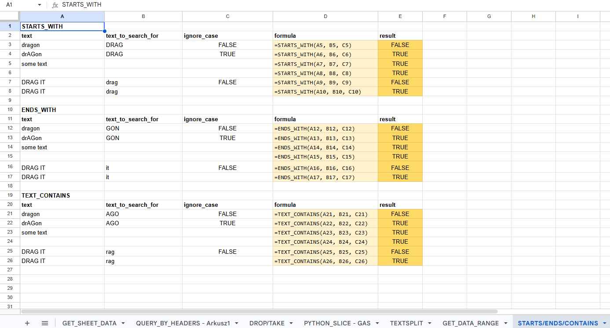

<br>

#### • **TEXT_REVERSE**
(text)

<details><summary>code</summary>

```
=LAMBDA(text, 
  IF(text="", "", TEXTJOIN("", FALSE, ARRAYFORMULA(MID(text, SEQUENCE(1, LEN(text), LEN(text), -1), 1))))
)(text)
```
</details><br>

Reverses 'text'.


<code>**text**</code> Text to be reversed<br>

Example: <code>=TEXT_REVERSE("abcdef")</code>

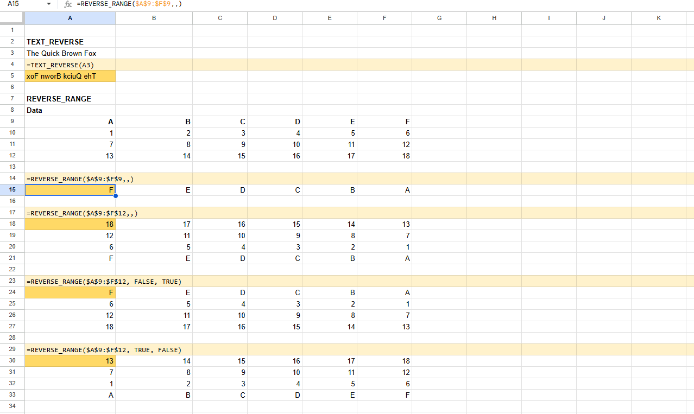

<br>

#### • **REVERSE_RANGE**
(range, reverse_rows, reverse_cols)

<details><summary>code</summary>

```
=LAMBDA(range, reverse_rows, reverse_cols,
LET(
  _reverse_rows, IF(ISBLANK(reverse_rows), TRUE, reverse_rows),
  _reverse_cols, IF(ISBLANK(reverse_cols), TRUE, reverse_cols),
  num_rows, ROWS(range),
  num_cols, COLUMNS(range),
  reversed_rows, IF(_reverse_rows, CHOOSEROWS(range, SEQUENCE(num_rows, 1, num_rows, -1)), range),
  reversed_cols, IF(_reverse_cols, CHOOSECOLS(reversed_rows, SEQUENCE(1, num_cols, num_cols, -1)), reversed_rows),
  reversed_cols
)
)(range, reverse_rows, reverse_cols)
```
</details><br>

Reverses rows and/or cols of the specified range.

<code>**range**</code> Range to be reversed<br>
<code>**reverse_rows**</code> (optional) wether to reverse rows (defaults to TRUE)<br>
<code>**reverse_cols**</code> (optional) wether to reverse columns (defaults to TRUE)<br>

Example: <code>=REVERSE_RANGE(A1:C5, FALSE, TRUE)</code>


<br>

#### • **MAP_RANGE**
(range, func)

<details><summary>code</summary>

```
=LAMBDA(range, func,
LET(
  num_rows, ROWS(range),
  num_cols, COLUMNS(range),
  MAKEARRAY(num_rows, num_cols, LAMBDA(r, c, func(INDEX(range, r, c), r, c)))
)
)(range, func)
```
</details><br>

Maps all values of 'range' by applying 'func'.

'func' must be a LAMBDA(val, r, c, <formula>)


<code>**range**</code> Range to map<br>
<code>**func**</code> a LAMBDA(val, r, c, <formula>) where 'r' and 'c' are row and column indices, and 'val' is the original value<br>

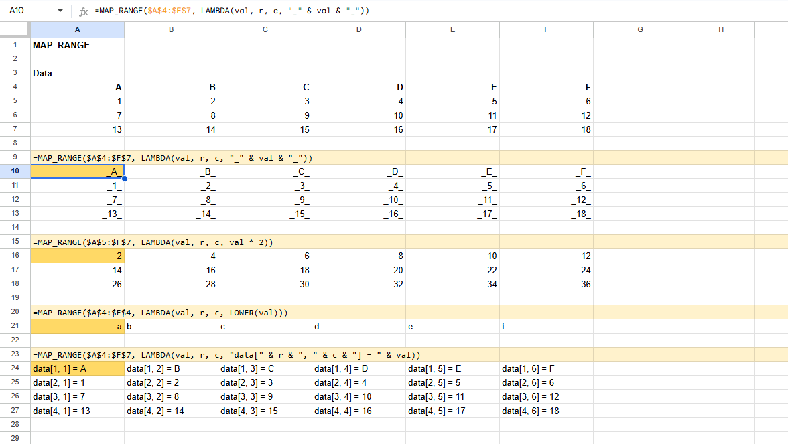

<br>

#### • **TRIMRANGE**
(range, trim_rows, trim_columns)

<details><summary>code</summary>

```
=LAMBDA(range, trim_rows, trim_columns,
LET(
  _trim_rows, IF(ISBLANK(trim_rows), 3, trim_rows),
  _trim_columns, IF(ISBLANK(trim_columns), 3, trim_columns),
  num_rows, ROWS(range),
  num_cols, COLUMNS(range),
  not_empty_row_indices, MAKEARRAY(num_rows, num_cols, LAMBDA(r, c, IF(INDEX(range, r, c) = "", 0, r))),
  not_empty_col_indices, MAKEARRAY(num_rows, num_cols, LAMBDA(r, c, IF(INDEX(range, r, c) = "", 0, c))),

  min_r, IF(OR(_trim_rows=0, _trim_rows=2), 1, REDUCE(0, not_empty_row_indices, LAMBDA(acc, idx, IF(AND(idx>0, acc=0), idx, acc)))),
  max_r, IF(OR(_trim_rows=0, _trim_rows=1), num_rows, REDUCE(0, not_empty_row_indices, LAMBDA(acc, idx, IF(idx=0, acc, idx)))),
  min_c, IF(OR(_trim_columns=0, _trim_columns=2), 1, REDUCE(0, TRANSPOSE(not_empty_col_indices), LAMBDA(acc, idx, IF(AND(idx>0, acc=0), idx, acc)))),
  max_c, IF(OR(_trim_columns=0, _trim_columns=1), num_cols, REDUCE(0, TRANSPOSE(not_empty_col_indices), LAMBDA(acc, idx, IF(idx=0, acc, idx)))),
  
  res_rows, max_r - min_r + 1,
  res_cols, max_c - min_c + 1,
  res_indices, {"", "min", "max", "len"; "row_indices", min_r, max_r, res_rows; "col_indices", min_c, max_c, res_cols},
  res, MAKEARRAY(res_rows, res_cols, LAMBDA(r, c, INDEX(range, min_r + r - 1, min_c + c - 1))),
  res
)
)(range, trim_rows, trim_columns)
```
</details><br>

Excludes blank cells from the edges of a range/array.

<code>**range**</code> Array or range to be trimmed<br>
<code>**trim_rows**</code> Determines which rows should be trimmed 0 - None 1 - Trims leading blank rows 2 - Trims trailing blank rows 3 - Trims both leading and trailing blank rows (default)<br>
<code>**trim_columns**</code> Determines which columns should be trimmed 0 - None 1 - Trims leading blank columns 2 - Trims trailing blank columns 3 - Trims both leading and trailing blank columns (default)<br>

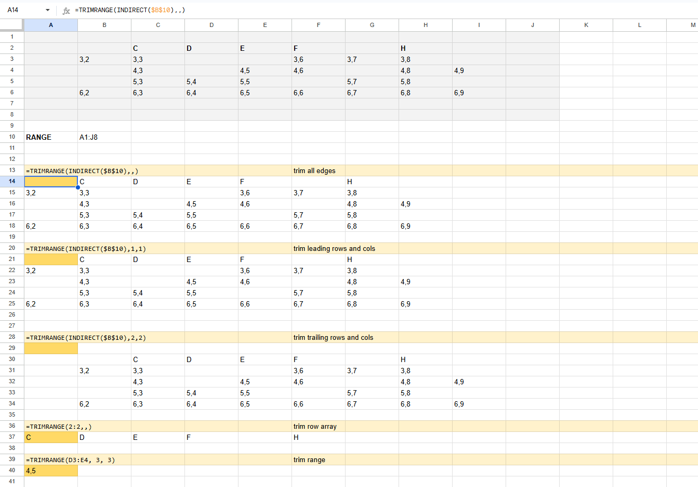
